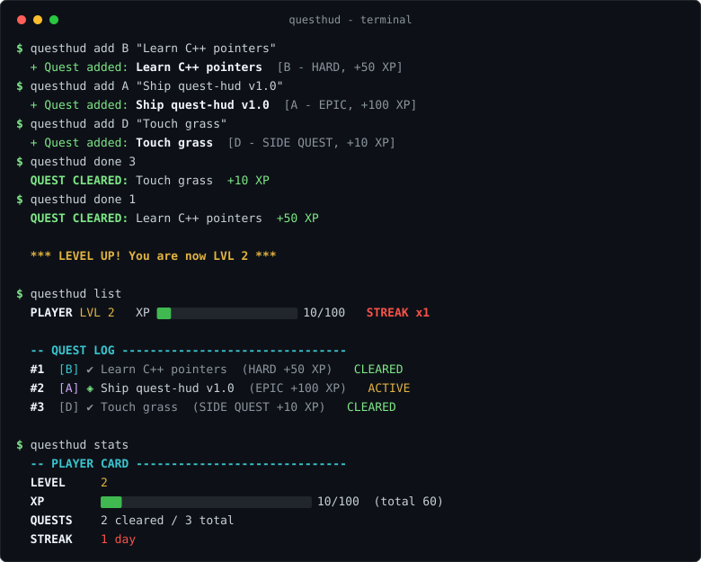

<div align="center">

# ⚔️ QUEST HUD

**Your to-do list, but it's a game.**

A terminal task tracker styled like a game HUD. Add quests, clear them for XP,
level up, and keep your daily streak alive.




</div>

---

## 🎮 Features

- **Quest log** - your tasks, ranked like game quests
- **XP & levels** - every cleared quest pays out XP; level up as you grind
- **Quest ranks** - `D` side quest (10 XP) to `S` legendary (200 XP)
- **Daily streaks** - clear at least one quest a day to keep the streak burning
- **Persistent save** - quests, XP and streak survive restarts (`questhud_save.txt`)
- **Zero dependencies** - one C++17 file, compiles anywhere, nothing to install
- **Two modes** - full interactive HUD, or fast one-shot commands for scripting

## 🚀 Build & run

You need any C++17 compiler (`g++`, `clang++`, or MSVC). That's it.

### Linux

```bash
g++ -std=c++17 -O2 -o questhud main.cpp
./questhud
```

### macOS

```bash
clang++ -std=c++17 -O2 -o questhud main.cpp
./questhud
```

### Windows (MinGW / MSYS2)

```bat
g++ -std=c++17 -O2 -o questhud.exe main.cpp
questhud.exe
```

### Windows (MSVC, Developer Command Prompt)

```bat
cl /std:c++17 /EHsc main.cpp
main.exe
```

Run with no arguments to enter the **interactive HUD**. Use the menu to add,
clear and abandon quests.

## 🕹️ Commands

You can also drive it one command at a time (great for aliases and scripts):

| Command | What it does |
| --- | --- |
| `questhud` | Open the interactive HUD |
| `questhud add [RANK] "title"` | New quest. RANK is `D C B A S` (default `C`) |
| `questhud list` | Show the quest log |
| `questhud done <id>` | Clear a quest, gain XP |
| `questhud drop <id>` | Abandon a quest |
| `questhud sweep` | Remove all cleared quests |
| `questhud stats` | Show your player card |

```bash
questhud add B "Learn C++ pointers"
questhud add S "Win a hackathon"
questhud done 1
```

## 🧮 How progression works

- Each rank pays XP: **D=10, C=25, B=50, A=100, S=200**
- Going from level `n` to `n+1` costs `50 * n` XP - the grind gets real
- Clear a quest on consecutive days to build a **streak**

## 💾 Where's my data?

Everything lives in `questhud_save.txt`, created in the folder where you run
the program. It's plain text - back it up, edit it, or delete it to start a
new game.

## 🗺️ Roadmap

- [ ] Boss quests (multi-step tasks with bonus XP)
- [ ] Achievements and unlockables
- [ ] Weekly XP graph in the terminal
- [ ] Import/export save files

## 📜 License

MIT - do whatever you want, just keep the notice.

---

<div align="center">
Built by <a href="https://github.com/nishan9-99">nishan9-99</a> :: CODE x CREATE x GAME
</div>
